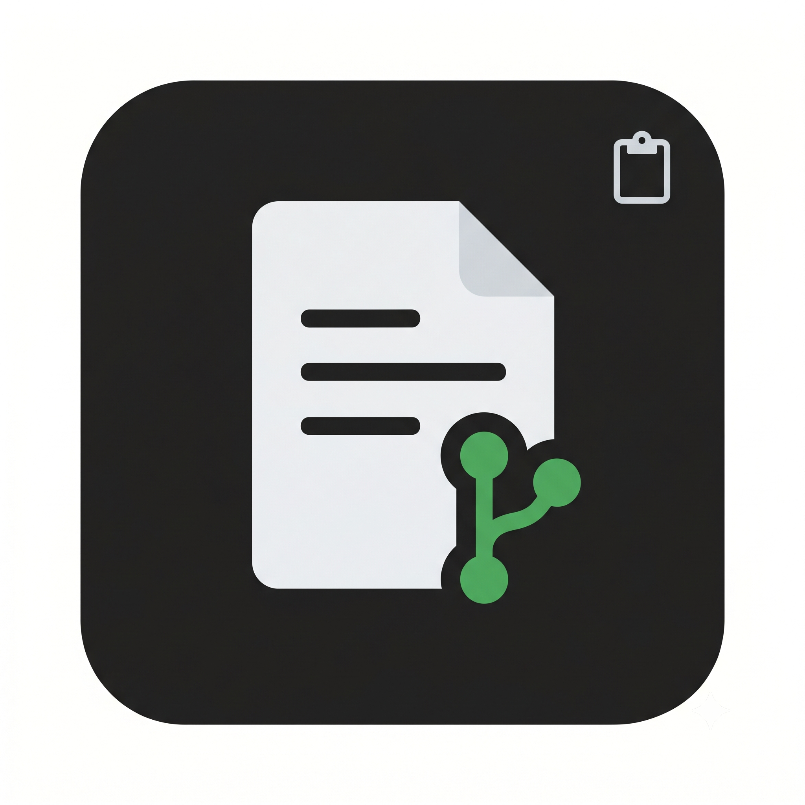

# OffDash

<p align="center">
  
</p>

**Paste-ready work updates from git evidence — without opening another dashboard.**

I lose time every week turning commits and diffs into standup bullets and stakeholder emails. Dashboards and “status portals” add a tab I never revisit. OffDash lives where I already work: **Command Palette → brief streams into an editor tab → copy to Slack or email.**

Built for the **Cursor Calgary June 2026 micro-hackathon** prompt: solve a real problem **without a conventional dashboard as the primary interface**.

## Live demo

| Surface | How judges try it |
|---------|-------------------|
| **Primary** | Install `.vsix` → open this repo → `OffDash: Standup Brief` |
| **Release** | `offdash-0.1.0.vsix` from repo root after `npm run package` |
| **No web dashboard** | There is no admin UI — only editor + clipboard |

## How it was built

The entire submission was authored with **[Cursor](https://cursor.com) only**.
No Claude Code, Codex, GitHub Copilot, Cline, or other agentic coding harness was used to build this repository.

## Summary for reviewers

| Criterion | How this project addresses it |
|-----------|--------------------------------|
| **Everyday pain point** | Developers paste git work into Slack/email daily — OffDash automates that loop |
| **AI-native** | Model drafts from **commits + diff + status** only; anti-hallucination system prompt |
| **Cursor fit** | Editor extension; commands in palette; output in markdown editor beside code |
| **Working demo** | Install VSIX → one command → streaming brief in ≤2 minutes |
| **Quality** | `npm test`; bounded diff size; explicit API errors |

## What it does

1. Reads git activity in the open workspace (lookback window, default 24h).
2. Bundles commits, diff stat, patch excerpt, and working tree status.
3. Streams a **standup** or **stakeholder** brief into a new markdown editor tab.
4. You edit, then copy — or run **OffDash: Copy Last Brief**.

## Judge checklist

1. Clone: `git clone https://github.com/Tokenlaxx/cursor-calgary-2026-june-micro-hackathon`
2. `cd cursor-calgary-2026-june-micro-hackathon && npm install && npm run package`
3. Cursor → Extensions → **Install from VSIX** → select `offdash-0.1.0.vsix`
4. Set `OPENROUTER_API_KEY` in shell or `offdash.apiKey` in settings
5. Open cloned folder → Command Palette → **OffDash: Standup Brief (from git evidence)**
6. Watch brief stream into editor → copy text

## Architecture

```
Command Palette → extension.ts → gitEvidence.ts → briefGenerator.ts (stream)
                                      ↓
                              Markdown editor tab (primary UI)
```

Stack: TypeScript, VS Code extension API, OpenAI-compatible chat completions (streaming).

## Verify locally

```bash
npm install
npm test
npm run build
```

Requires: Node 20+, git repo, OpenRouter API key (or any OpenAI-compatible endpoint).

## Configuration

Copy `.env.example` to `.env` for local reference (extension reads env + `offdash.*` settings).

| Setting | Default |
|---------|---------|
| `offdash.lookbackHours` | 24 |
| `offdash.model` | `openrouter/free` (OpenRouter free-model routing) |
| `offdash.apiBaseUrl` | https://openrouter.ai/api/v1 |

## Licence

Apache-2.0
